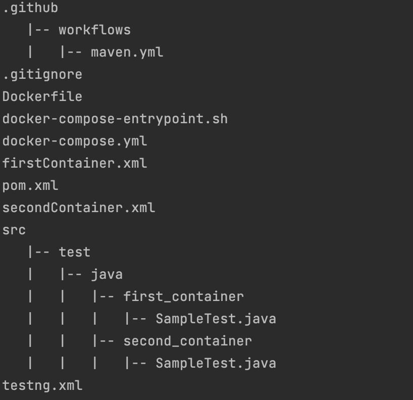

# Run tests in multiple containers


This is a simple example of how to run tests in multiple containers using [Docker](https://www.docker.com/) and [Docker Compose](https://docs.docker.com/compose/).
and generate a common allure report.
## File structure


## Overview

1. **Dockerfile**: This file contains the Dockerfile configuration, which uses maven-jdk image. It also copies the `pom.xml`, `src` folder, and XML files.
2. **docker-compose.yml**: The Docker Compose file defines three services:
    - The first two services are used to run tests in two different containers.
    - The third service is responsible for generating the common allure report.
3. **pom.xml**: This file contains the project dependencies.
4. **src/test**: This directory contains the test files.
5. **\*.xml**: Multiple XML files are created to specify the tests to be run in each container.


## How to run

1. Clone the repository
2. Run the following command to run the tests in multiple containers and generate a common allure report.
* To run specific groups, use the following command
```bash
./docker-compose-entrypoint.sh  <-Dgroups={group_name}> <-Dgroups={group_name}>
```
Example:
```bash
./docker-compose-entrypoint.sh  -Dgroups=container1 -Dgroups=container2
```

* To run specific xml files, use the following command
```bash
./docker-compose-entrypoint.sh  <-Dsurefire.suiteXmlFiles={xml_file_name}> <-Dsurefire.suiteXmlFiles={xml_file_name}>
```
Example:
```bash
./docker-compose-entrypoint.sh  -Dsurefire.suiteXmlFiles=container1.xml -Dsurefire.suiteXmlFiles=container2.xml
```


## How to view the report

After running the tests, to view the combined allure report.

1. Go to your chrome browser and type the following url
```bash
http://localhost:5050/allure-docker-service/latest-report
```

## After running tests in multiple continers, if u want to run the tests in only one of the container

1. Open the terminal
2. Get the container id of the container in which you want to run the tests
```bash
docker ps
```
3. Run the following command to run the tests in the container
```bash
docker exec -it <container_id> /bin/bash
```
4. Run the following command to run the tests in the container
```bash
mvn  test -Dgroups={group_name}
```
5. Now refresh the below link you will be able to see the latest test along with the previous run in the report
```bash
http://localhost:5050/allure-docker-service/latest-report
```

### Resources
- [Environment variables in Compose Rotem Boguslavsky](https://medium.com/@rotempinchevskiboguslavsky/environment-variables-in-container-vs-docker-compose-file-2426b2ec7d8b)
- [Docker Compose Environment Variables](https://docs.docker.com/compose/environment-variables/set-environment-variables/)
- [allure-docker-service](https://github.com/fescobar/allure-docker-service)
- [docker volumes by techworld with nana](https://www.youtube.com/watch?v=p2PH_YPCsis)
- [docker-volumes](https://docs.docker.com/storage/volumes/)
- [Keep container running](https://stackoverflow.com/questions/38546755/docker-compose-keep-container-running)
